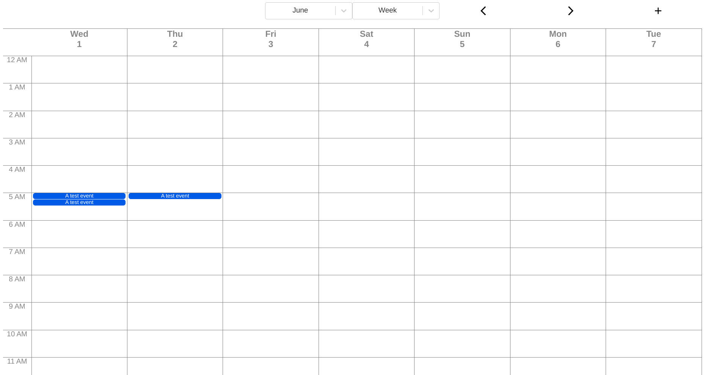

# Calendar

A simple Calendar app based on Js and reactJs. This app is part of larger collection of apps and tools that are being planned to build an ecosystem.

## Features:

1. Month view
2. Week view
3. Add new event
4. Cleaner UI
5. Add mulitple guests to the events
6. Full day events
7. Holidays
8. Highlight the day that has a full day event
9. Simpler navigation (previous week and next week)

See other apps:

1. https://github.com/arunkumar413/pradarshana (A web based presentation tool)

2. https://github.com/arunkumar413/tippani (A temporary simple plain text notes app )

3. A HMTL based document creator (net yet created)

4. A diagram creator using svg icons (not yet created)
